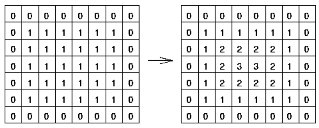
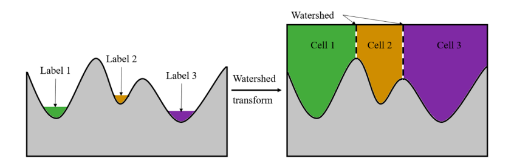

# Командный проект на тему "Отслеживание cкорости пролиферации клеток HeLa cells stably expressing H2b-GFP (2D)"
Использовались [изображения](http://celltrackingchallenge.net/2d-datasets/) из экспериментов с раковыми клетками шейки матки.
Реализация Python для отслеживания раковых клеток, в которой использовался алгоритм водораздела (watershed) для сегментации ячеек и строился вектор признаков для отслеживания ячеек, включая информацию о положении и пространственном распределении.

# Описание работы 
В данном разделе приводится краткое методов, используемых в этой работе

## Введение
Отслеживание клеточной динамики -- одно из наиболее важных инструментов для анализа изображений с временной разверткой, позволяющий наблюдать за поведением клеток и их развитием в течение длительного периода времени. 

Миграция клеток играет важную роль в различных процессах, таких как эмбриональное развитие ([https://doi.org/10.1016/j.bpj.2012.10.015](https://doi.org/10.1016/j.bpj.2012.10.015), [https://doi.org/10.1038/nmat3943](https://doi.org/10.1038/nmat3943)), дифференцирование клеток ([https://doi.org/10.1371/journal.pone.0045237](https://doi.org/10.1371/journal.pone.0045237)), иммунный ответ ([https://doi.org/10.3389/fcell.2019.00141](https://doi.org/10.3389/fcell.2019.00141)), регенирация ([https://doi.org/10.1039/c6lc01308b](https://doi.org/10.1039/c6lc01308b)) и развитие опухолей.

Поскольку внешний вид и поведение клеток могут сильно отличаться от поведения частиц, методы обработки изображений, разработанные для их отслеживания, обычно также сильно отличаются друг от друга, поэтому здесь они рассматриваются отдельно. В любом случае проблема отслеживания, как правило, имеет две стороны: 

1.  распознавание соответствующих объектов и их отделение от фона в каждом кадре (**этап сегментации**); 
2.  объединение сегментированных объектов от кадра к кадру и установление связей (**этап связывания**).

Популярными примерами являются сопоставление шаблонов, *преобразование watershed* (которое полностью разделяет изображения на области и разграничивает контуры, но может легко привести к пересегментации) и *деформируемые модели* (которые используют как информацию об изображении, так и предварительную информацию о форме).

## Методы
В данной работе использовались следующие методы:

1.  **Нормализация**: так как исходное изображение имеет низкий контраст, то его необходимо нормализовать;
2.  **Бинаризация**: для получения грубого бинарного изображения, в котором пиксель, классифицированный как клетка, является передним планом, реализуется метод адаптивной пороговой бинаризации;
3.  **Нахождение центра**: для определения центра каждой клетки используется distance map. Результатом преобразования является полутоновое изображение, похожее на входное, за исключением того, что интенсивность точек внутри областей переднего плана изменяется, чтобы показать расстояние до ближайшей границы от каждой точки ([рисунок 1](ris/ris1.png)).

После преобразования с помощью фильтра ищутся самые яркие точки, которые являются центром клетки.
4.  **Определение границ клеток**: для этой цели используется так называемый алгоритм сегментации по водоразделам (*watershed*). Алгоритм работает с изображением как с функцией от двух переменных $f=I(x, y)$, где $x, y$ -- координаты пикселя. Значением функции является интенсивность пикселя, таким образом изображение представляется как рельефная поверхность, которая постепенно начинает заполняться водой. Суть метода заключается в построении границ между объектами, называемыми водоразделами. Это делается для того, чтобы предотвратить слияние областей. Алгоритм работает до тех пор, пока все объекты не будут отделяться друг от друга искусственными границами. Ниже приведена [картинка](ris/ris2.png), демонстрирующая работу данного алгоритма.
